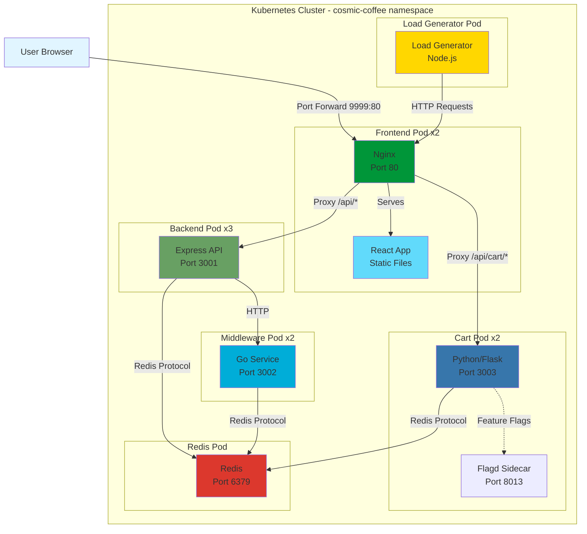
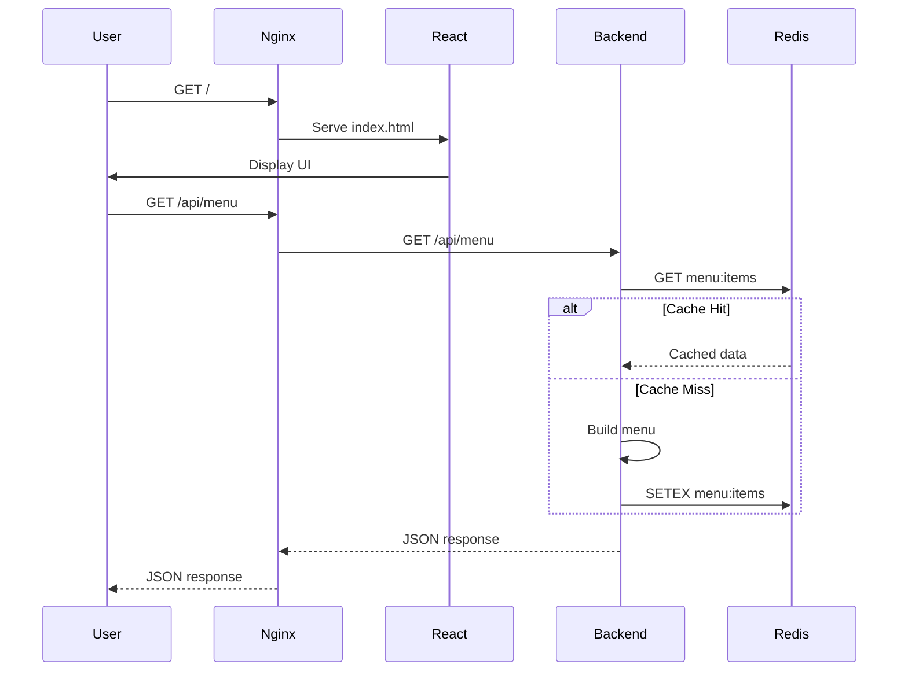
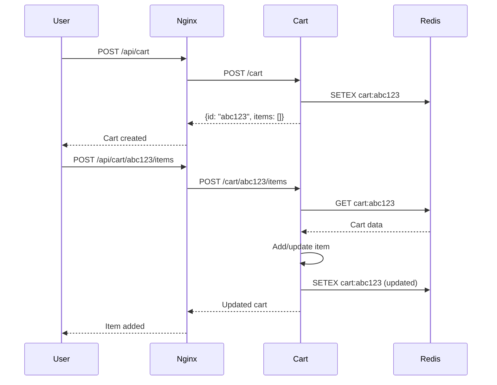
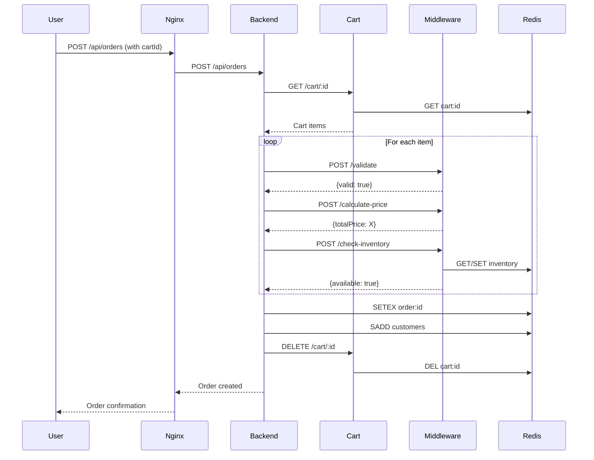
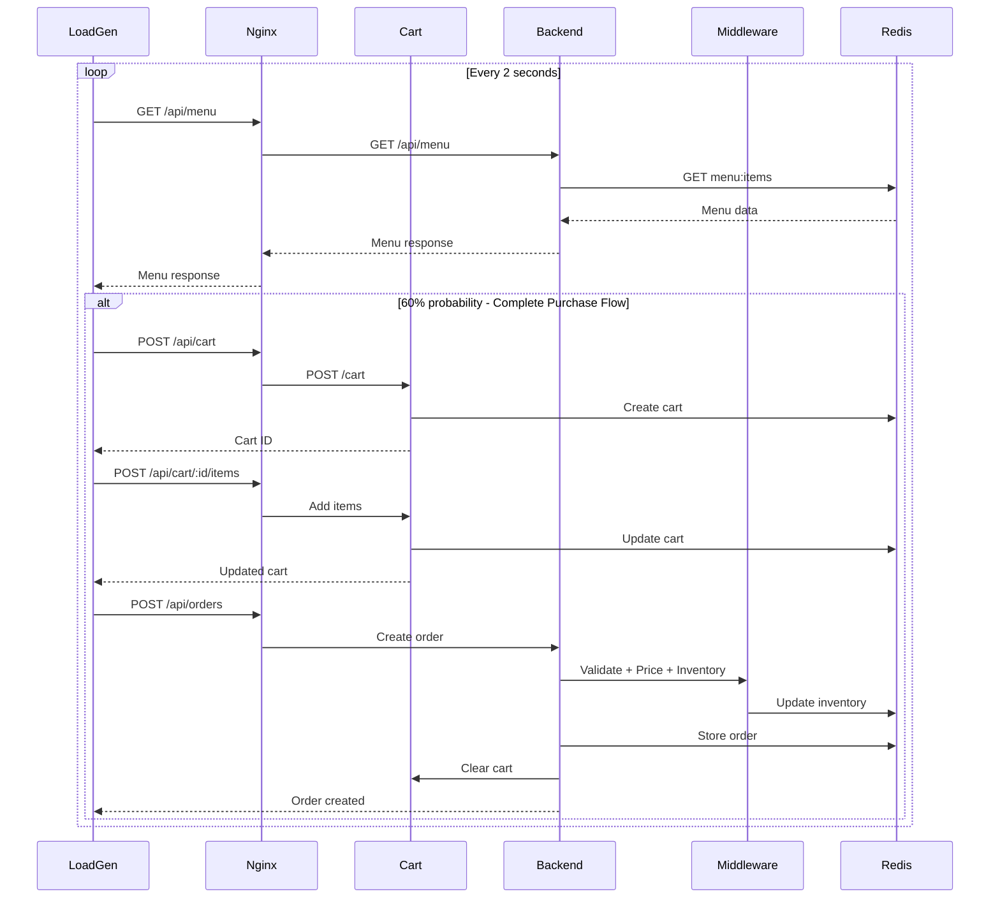
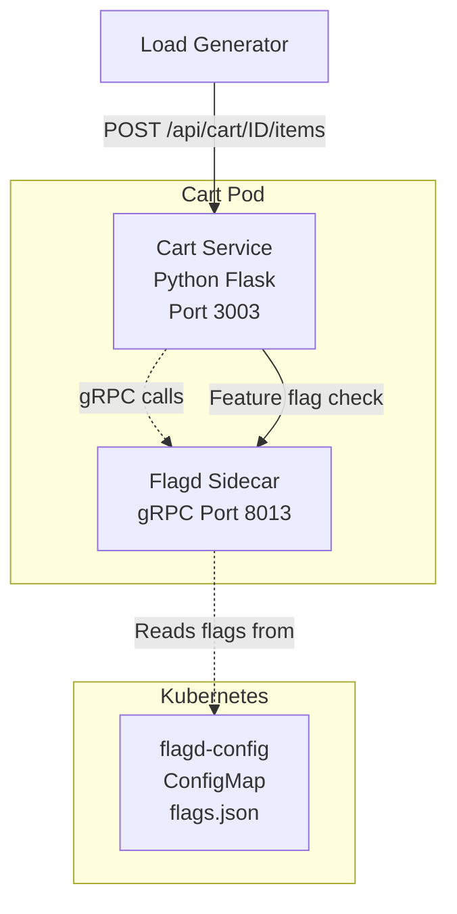

# Cosmic Coffee Shop - Service Architecture

## Service Map



## Service Overview

The Cosmic Coffee Shop is a **6-service microservices application** demonstrating modern cloud-native architecture with services written in **4 different languages**:

| Service | Language | Port | Purpose |
|---------|----------|------|---------|
| Frontend | React + Nginx | 80 | Web UI and reverse proxy |
| Cart | Python/Flask | 3003 | Shopping cart management |
| Backend | Node.js/Express | 3001 | REST API and orchestration |
| Middleware | Go | 3002 | Business logic and inventory |
| Redis | Redis | 6379 | Data persistence and caching |
| Load Generator | Node.js | N/A | Traffic generation |

---

## Service Details

### 1. Frontend Service (React + Nginx)
- **Technology**: React 18, Nginx
- **Port**: 80
- **Replicas**: 2
- **Type**: ClusterIP

#### Responsibilities:
- Serves static React application
- Acts as reverse proxy for backend services
- Handles client-side routing
- Proxies `/api/cart/*` requests to Cart service
- Proxies other `/api/*` requests to Backend service

#### Dependencies:
- Cart service (internal DNS: `http://cart:3003`)
- Backend API (internal DNS: `http://backend:3001`)

#### Endpoints:
- `GET /` - React application
- `GET /api/cart/*` - Proxied to Cart service
- `GET /api/*` - Proxied to Backend
- `GET /health` - Health check

---

### 2. Cart Service (Python/Flask) + Flagd Sidecar ⭐
- **Technology**: Python 3.11, Flask, Gunicorn, OpenFeature SDK
- **Port**: 3003 (Cart), 8013 (Flagd gRPC)
- **Replicas**: 2
- **Type**: ClusterIP

#### Responsibilities:
- Shopping cart session management
- Add/remove/update items in cart
- Temporary cart storage (1-hour TTL)
- Cart-to-order conversion
- Feature flag controlled chaos injection

#### Dependencies:
- Redis (internal DNS: `redis:6379`)
- Flagd sidecar (localhost:8013) for feature flags

#### Endpoints:
- `GET /health` - Health check
- `POST /cart` - Create new cart
- `GET /cart/:id` - Get cart by ID
- `POST /cart/:id/items` - Add item to cart
- `PATCH /cart/:id/items/:itemId` - Update item quantity
- `DELETE /cart/:id/items/:itemId` - Remove item from cart
- `DELETE /cart/:id` - Clear cart

#### Data Structure:
```json
{
  "id": "abc123",
  "items": [
    {
      "itemId": "nebula-latte",
      "itemName": "Nebula Latte",
      "itemEmoji": "🌌",
      "quantity": 2,
      "basePrice": 5.99,
      "addedAt": "2025-12-09T20:30:00.000Z"
    }
  ],
  "createdAt": "2025-12-09T20:30:00.000Z",
  "updatedAt": "2025-12-09T20:35:00.000Z"
}
```

---

### 3. Backend Service (Node.js/Express)
- **Technology**: Node.js 18, Express
- **Port**: 3001
- **Replicas**: 3
- **Type**: ClusterIP

#### Responsibilities:
- REST API for menu, orders, and customers
- Orchestrates calls to Middleware service
- Converts carts to orders
- Stores data in Redis
- Implements business logic

#### Dependencies:
- Middleware service (internal DNS: `http://middleware:3002`)
- Redis (internal DNS: `redis://redis:6379`)

#### Endpoints:
- `GET /health` - Health check
- `GET /api/menu` - Get all menu items
- `GET /api/menu/:id` - Get specific menu item
- `GET /api/orders` - Get all orders
- `GET /api/orders/:id` - Get specific order
- `POST /api/orders` - Create new order
- `PATCH /api/orders/:id` - Update order status
- `GET /api/customers` - Get all customers
- `GET /api/customers/:name/orders` - Get customer orders

---

### 4. Middleware Service (Go)
- **Technology**: Go 1.21
- **Port**: 3002
- **Replicas**: 2
- **Type**: ClusterIP

#### Responsibilities:
- Order validation
- Dynamic pricing calculation (time-based, bulk discounts)
- Inventory management with auto-replenishment
- Business rule enforcement

#### Dependencies:
- Redis (internal DNS: `redis:6379`)

#### Endpoints:
- `GET /health` - Health check
- `POST /validate` - Validate order data
- `POST /calculate-price` - Calculate dynamic pricing
- `POST /check-inventory` - Check and update inventory

#### Inventory Management:
- **Initial Stock**: 200-300 items per product
- **Replenishment Trigger**: Stock < 50
- **Replenishment Amount**: 100-200 items
- **Replenishment Probability**: 80%

---

### 5. Redis Service
- **Technology**: Redis 7 (Alpine)
- **Port**: 6379
- **Replicas**: 1
- **Type**: ClusterIP

#### Responsibilities:
- Cart storage (1-hour TTL)
- Order storage (1-hour TTL)
- Inventory tracking (persistent)
- Customer session management
- Menu caching (5-minute TTL)

#### Data Structures:
- `cart:{id}` - Shopping carts
- `menu:items` - Cached menu (TTL: 300s)
- `order:{id}` - Individual orders (TTL: 3600s)
- `customers` - Set of customer names
- `inventory:{itemId}` - Inventory counts

---

### 6. Load Generator Service (Node.js)
- **Technology**: Node.js 18
- **Replicas**: 1
- **Type**: Headless (ClusterIP: None)

#### Responsibilities:
- Generate realistic traffic patterns
- Simulate complete user journeys
- Create observability data through full stack

#### Configuration:
- `FRONTEND_URL`: `http://frontend`
- `REQUEST_RATE`: 30 requests/minute (configurable)

#### Behavior:
- 80% chance: Fetch menu
- 60% chance: Place order (now goes through cart)
- 30% chance: Check order history
- 10% chance: Check customers list

---

## Request Flow Examples

### 1. User Views Menu



### 2. User Adds Item to Cart



### 3. User Places Order from Cart



### 4. Load Generator Traffic Flow



---

## Technology Stack Summary

### Languages & Frameworks
1. **Frontend**: JavaScript (React 18), HTML/CSS
2. **Backend**: JavaScript (Node.js 18, Express)
3. **Cart**: Python 3.11 (Flask, Gunicorn, OpenFeature SDK)
4. **Middleware**: Go 1.21
5. **Load Generator**: JavaScript (Node.js 18)

### Infrastructure
- **Container Runtime**: Docker
- **Orchestration**: Kubernetes
- **Reverse Proxy**: Nginx
- **Database**: Redis 7
- **Feature Flags**: OpenFeature + Flagd (CNCF)

### Multi-Architecture Support
All services are built for:
- `linux/amd64` (Intel/AMD processors)
- `linux/arm64` (AWS Graviton, Apple Silicon)

---

## Network Architecture

### Service Communication

```
Frontend (nginx:80)
    ├─→ Cart Service (cart:3003) [Python]
    └─→ Backend API (backend:3001) [Node.js]
            ├─→ Middleware (middleware:3002) [Go]
            └─→ Redis (redis:6379)

Cart Service (cart:3003)
    └─→ Redis (redis:6379)

Middleware (middleware:3002)
    └─→ Redis (redis:6379)

Load Generator
    └─→ Frontend (frontend:80)
```

### Service Discovery

All services use Kubernetes DNS for service discovery:

| Service | Internal DNS | Port |
|---------|-------------|------|
| Frontend | `frontend.cosmic-coffee.svc.cluster.local` | 80 |
| Cart | `cart.cosmic-coffee.svc.cluster.local` | 3003 |
| Backend | `backend.cosmic-coffee.svc.cluster.local` | 3001 |
| Middleware | `middleware.cosmic-coffee.svc.cluster.local` | 3002 |
| Redis | `redis.cosmic-coffee.svc.cluster.local` | 6379 |

Short form works within the same namespace:
- `http://frontend`
- `http://cart:3003`
- `http://backend:3001`
- `http://middleware:3002`
- `redis://redis:6379`

---

## Observability Patterns

### Distributed Tracing

Complete trace path through all services:
```
User Request → Nginx → Cart Service → Redis
                  ↓
              Backend → Middleware → Redis
                  ↓
               Redis
```

### Metrics to Monitor

1. **Frontend**:
   - Request count by endpoint
   - Response time distribution
   - Error rate (4xx, 5xx)
   - Static asset cache hit rate
   - Proxy performance to cart vs backend

2. **Cart Service** ⭐:
   - Cart creation rate
   - Items added/removed per minute
   - Cart session duration
   - Cart-to-order conversion rate
   - Average items per cart
   - Redis latency
   - Feature flag evaluation rate
   - Chaos error injection rate (when enabled)

3. **Backend**:
   - API endpoint latency
   - Requests per second
   - Error rate by endpoint
   - Redis connection pool stats
   - Middleware call latency
   - Cart service call latency

4. **Middleware**:
   - Validation success rate
   - Pricing calculation time
   - Inventory check latency
   - Auto-replenishment events
   - Redis operations per second

5. **Redis**:
   - Command execution time
   - Memory usage
   - Connected clients
   - Cache hit/miss ratio
   - Key expiration rate

6. **Load Generator**:
   - Request rate
   - Success/failure ratio
   - Average response time
   - Complete flow completion rate

### Key Metrics for Demo

- **Cart Abandonment Rate**: Carts created vs orders placed
- **Service Response Time**: P50, P95, P99 latencies
- **Error Rate**: 5xx errors across all services
- **Inventory Events**: Stock levels and replenishment
- **Request Flow**: Trace across all 6 services

---

## Security Considerations

1. **Service-to-Service**: All internal communication uses ClusterIP
2. **External Access**: Only frontend exposed (via port-forward or Ingress)
3. **Pod Security**: All containers run as non-root users (UID 1001)
4. **Secrets**: No sensitive data in ConfigMaps (use Secrets for production)
5. **Network Isolation**: Services can only communicate as defined
6. **Resource Limits**: All services have CPU/memory limits

### Recommended Network Policies

```yaml
Frontend → Can reach: Cart, Backend
Cart → Can reach: Redis only
Backend → Can reach: Middleware, Redis
Middleware → Can reach: Redis only
Redis → Accepts from: Cart, Backend, Middleware
Load Generator → Can reach: Frontend only
```

---

## Scaling Considerations

### Horizontal Pod Autoscaling (HPA)

Recommended HPA configuration:

| Service | Min | Max | Metric | Target |
|---------|-----|-----|--------|--------|
| Frontend | 2 | 5 | CPU | 70% |
| Cart | 2 | 8 | CPU or RPS | 60% |
| Backend | 3 | 10 | CPU or RPS | 60% |
| Middleware | 2 | 8 | CPU | 70% |
| Redis | 1 | 1 | N/A | N/A* |
| Load Generator | 1 | 1 | N/A | Fixed |

*Consider Redis Cluster for production

### Resource Allocation

Current configuration:

| Service | Memory Request | Memory Limit | CPU Request | CPU Limit |
|---------|---------------|--------------|-------------|-----------|
| Frontend | 64Mi | 256Mi | 50m | 500m |
| Cart | 128Mi | 512Mi | 100m | 1000m |
| Backend | 128Mi | 512Mi | 100m | 1000m |
| Middleware | 64Mi | 256Mi | 100m | 500m |
| Redis | 64Mi | 256Mi | 100m | 500m |
| Load Generator | 64Mi | 128Mi | 50m | 200m |

**Total Resources**:
- Minimum: ~0.6 CPU, ~640Mi RAM
- Maximum: ~3.7 CPU, ~2.6Gi RAM

---

## Deployment Order

For clean deployment, services should be deployed in this order:

1. **Namespace** - Create cosmic-coffee namespace
2. **Redis** - Stateful service, foundational dependency
3. **Middleware** - Depends only on Redis
4. **Cart** - Depends only on Redis
5. **Backend** - Depends on Redis, Middleware, and Cart
6. **Frontend** - Depends on Backend and Cart
7. **Load Generator** - Depends on Frontend

The `deploy-k8s.sh` script handles this automatically with health check waits between each step.

---

## Data Flow Summary

### Complete User Journey

1. **Browse Menu**: User → Frontend → Backend → Redis
2. **Add to Cart**: User → Frontend → Cart → Redis
3. **Place Order**: User → Frontend → Backend → Cart + Middleware → Redis
4. **View Orders**: User → Frontend → Backend → Redis

### Service Interactions

```
┌─────────────────────────────────────────────────┐
│                  User Browser                    │
└────────────────────┬────────────────────────────┘
                     │
                     ▼
┌─────────────────────────────────────────────────┐
│         Frontend (React + Nginx)                 │
│  - Serves UI                                     │
│  - Routes /api/cart/* → Cart Service            │
│  - Routes /api/* → Backend                       │
└─────┬────────────────────────────────┬──────────┘
      │                                 │
      ▼                                 ▼
┌──────────────────┐          ┌─────────────────┐
│  Cart Service    │          │  Backend API    │
│  (Python/Flask)  │          │  (Node.js)      │
│  - Cart CRUD     │          │  - Orders       │
│  - Session Mgmt  │          │  - Menu         │
└────────┬─────────┘          └────────┬────────┘
         │                              │
         │                              ▼
         │                     ┌─────────────────┐
         │                     │  Middleware     │
         │                     │  (Go)           │
         │                     │  - Validation   │
         │                     │  - Pricing      │
         │                     │  - Inventory    │
         │                     └────────┬────────┘
         │                              │
         └──────────────┬───────────────┘
                        ▼
                ┌────────────────┐
                │     Redis      │
                │  - Carts       │
                │  - Orders      │
                │  - Inventory   │
                │  - Cache       │
                └────────────────┘
```

---

## Testing the Architecture

### Local Testing (Docker Compose)

```bash
docker-compose up
# Frontend: http://localhost:3000
# Backend: http://localhost:3001
# Middleware: http://localhost:3002
# Cart: http://localhost:3003
```

### Kubernetes Testing

```bash
# Deploy all services
./deploy-k8s.sh

# Port forward frontend
kubectl port-forward -n cosmic-coffee service/frontend 9999:80

# Access at http://localhost:9999
```

### Service Health Checks

```bash
# Check all pods
kubectl get pods -n cosmic-coffee

# Check service health
kubectl exec -n cosmic-coffee deployment/frontend -- wget -qO- http://cart:3003/health
kubectl exec -n cosmic-coffee deployment/frontend -- wget -qO- http://backend:3001/health
kubectl exec -n cosmic-coffee deployment/frontend -- wget -qO- http://middleware:3002/health
```

---

## Feature Flags with OpenFeature

### Overview

The Cosmic Coffee Shop integrates [OpenFeature](https://openfeature.dev/), a CNCF incubating project that provides a vendor-agnostic API for feature flagging. This enables dynamic control over application behavior without code changes or redeployments.

### Architecture

The implementation uses the **sidecar pattern** with Flagd as the feature flag provider:



### Implementation Details

**Flagd Sidecar:**
- Runs alongside the cart service in the same pod
- Communicates via localhost on port 8013 (gRPC)
- Reads flag configuration from a mounted ConfigMap
- Zero external dependencies or network calls

**OpenFeature SDK Integration:**
- Python SDK: `openfeature-sdk==0.8.4` and `openfeature-provider-flagd==0.2.6`
- Flagd sidecar: `ghcr.io/open-feature/flagd:v0.12.9`
- Initialized at application startup
- Gracefully degrades if Flagd is unavailable
- Provides context-aware flag evaluation

### Current Feature Flags

#### 1. Cart Chaos Errors (`cart-chaos-errors`)

**Purpose:** Inject controlled chaos/errors into the cart service for observability demos

**Configuration:**
```json
{
  "enabled": true,
  "errorRate": 15,      // Percentage of requests that fail (0-100)
  "delayMs": 2000       // Delay before returning error (milliseconds)
}
```

**Behavior:**
- Applied to the "add items to cart" endpoint only
- When enabled, randomly fails X% of requests
- Returns HTTP 503 (Service Unavailable) after configured delay
- Includes retry-after header for client guidance

**Demo Value:**
- Demonstrates feature flag control over application behavior
- Shows APM/observability tool capabilities for error tracking
- Enables testing error handling and retry logic
- No code changes or redeployments required to adjust behavior

### Managing Feature Flags

#### View Current Configuration

```bash
kubectl get configmap flagd-config -n cosmic-coffee -o yaml
```

#### Update Flag Values

Edit the ConfigMap:
```bash
kubectl edit configmap flagd-config -n cosmic-coffee
```

Modify the flag values (e.g., change `errorRate` from 15 to 30):
```json
{
  "enabled": true,
  "errorRate": 30,
  "delayMs": 3000
}
```

Save and restart the cart pods:
```bash
kubectl rollout restart deployment/cart -n cosmic-coffee
```

#### Disable a Flag

Set `defaultVariant` to `"off"` or set `enabled: false`:
```json
{
  "defaultVariant": "off"
}
```

### Adding New Feature Flags

To add a new feature flag:

1. **Define the flag** in `k8s/cart/flagd-config.yaml`:
```json
{
  "flags": {
    "new-feature-name": {
      "state": "ENABLED",
      "variants": {
        "on": { "enabled": true },
        "off": { "enabled": false }
      },
      "defaultVariant": "on"
    }
  }
}
```

2. **Check the flag** in application code:
```python
from openfeature.evaluation_context import EvaluationContext

if feature_flag_client:
    context = EvaluationContext(targeting_key="user123", attributes={"endpoint": "add_item"})
    config = feature_flag_client.get_object_value(
        "new-feature-name",
        {"enabled": False},  # default value
        evaluation_context=context
    )
    
    if config.get("enabled", False):
        # New feature behavior
        pass
```

3. **Apply changes:**
```bash
kubectl apply -f k8s/cart/flagd-config.yaml
kubectl rollout restart deployment/cart -n cosmic-coffee
```

### Observability Impact

With feature flags enabled, observability tools can track:

- **Request Success/Failure Rates:** Percentage of failed requests matches `errorRate`
- **Latency Patterns:** Failed requests show delay matching `delayMs`
- **Error Attribution:** Log entries include "Feature flag triggered chaos"
- **Service Dependencies:** APM traces show cart service as error source
- **User Impact:** Demonstrates how feature flags affect user experience

### Future Enhancement Opportunities

The OpenFeature foundation enables additional capabilities:

1. **Dynamic Pricing:** A/B test different pricing strategies
2. **Cart Behavior Variants:** Test different cart expiration times
3. **Regional Features:** Enable/disable features by region
4. **Gradual Rollouts:** Roll out features to percentage of users
5. **Circuit Breaking:** Automatically disable features under load
6. **Multi-Service Flags:** Extend to backend, middleware, and frontend

### Resources

- [OpenFeature Documentation](https://openfeature.dev/docs/)
- [Flagd Provider Documentation](https://openfeature.dev/docs/reference/technologies/server/flagd/)
- [Feature Flag Best Practices](https://openfeature.dev/docs/tutorials/)

---

## Future Enhancements

Potential additions for expanded demos:

1. **Payment Service**: Mock payment processing
2. **Notification Service**: Email/SMS notifications
3. **Analytics Service**: Real-time metrics aggregation
4. **API Gateway**: Kong or Ambassador for unified entry point
5. **Service Mesh**: Istio or Linkerd for advanced traffic management
6. **Message Queue**: RabbitMQ or Kafka for async processing
7. **Database**: PostgreSQL for persistent order history

---

## Summary

The Cosmic Coffee Shop microservices application demonstrates:

- ✅ **Multi-language architecture** (React, Node.js, Python, Go)
- ✅ **6 interconnected services** with realistic dependencies
- ✅ **Shopping cart pattern** with session management
- ✅ **Distributed transactions** across multiple services
- ✅ **Container orchestration** with Kubernetes
- ✅ **Observability features** (logging, metrics, tracing)
- ✅ **Production patterns** (health checks, resource limits, scaling)
- ✅ **Multi-architecture support** (amd64 + arm64)
- ✅ **Feature flags** with OpenFeature and Flagd sidecar

Perfect for demonstrating SaaS observability platforms! 🚀☕
